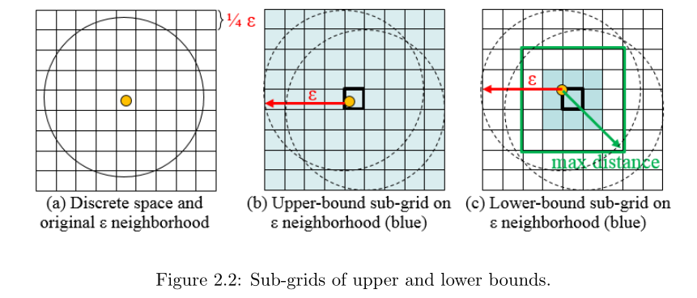

# Significant-DBSCAN-towards-Statistically-Robust-Clustering
## Overview
## Derivation
+ Upper bound & lower bound

    

    Derivation of the lower bound: 
    
    k is an odd number representing the side length
(unit: cell) of the sub-grid neighborhood. Then:

    $$(\frac{k-1}{2}+1) \sqrt{2}L \leq \epsilon \Rightarrow \frac{k-1}{2} \leq \frac{\epsilon}{\sqrt{2}L} - 1 \Rightarrow k \leq \frac{\sqrt{2} \epsilon}{L} - 1$$
## Questions
+ Q1: Why use cluster size  as Test statistic?
  
  A1:
+ Q2: